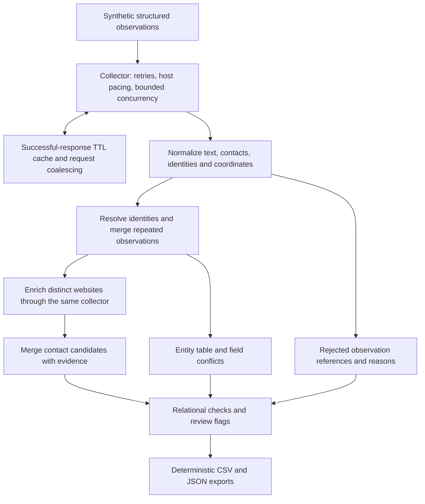

# Business Data Collection & Enrichment Pipeline

A layered Python pipeline for turning heterogeneous location observations into business entities, related contact candidates, and explicit quality exceptions. It demonstrates data preparation for BI and decision support: counting retained entities separately from contact rows, preserving provenance, and making collection failures visible.

The published example is entirely synthetic and runs offline. It makes no claims about real market coverage, verified contact accuracy, or production readiness.

## Reproduce

Use Python 3.10 or later; there are no third-party dependencies. From the project directory:

```sh
python -B -m unittest discover -s tests -v
python -B run_pipeline.py --fixture data/sample/fixtures.json --output outputs/sample
```

The CLI uses fixture responses only and makes no network requests. Identical fixture bytes and configuration produce identical output bytes; the validation report includes the fixture SHA-256. The sample is intentionally imperfect: a successful run reports `review_required`, because one observation is rejected and one enrichment page is unavailable. Exit code 0 means structural checks passed, not that every record is suitable for use; downstream acceptance should also inspect the report status and issues.

## Workflow

1. Collect a location JSON response through an injected asynchronous transport.
2. Normalize names, addresses, international phone syntax, email syntax, website URLs, and coordinate pairs; quarantine malformed observations.
3. Group observations by source object identity, or by exact normalized name and address when identity is absent. Keep otherwise unresolved observations separate.
4. Fetch each distinct website once and extract contact candidates from `tel:` / `mailto:` links and structured JSON data.
5. Export entity and contact tables, provenance, rejected rows, field conflicts, collection statistics, and validation checks.

Known distinct source object identities remain separate even when they share a website or telephone. Contacts live in a separate one-to-many table; multiple phones and emails never produce a Cartesian product of business rows. Conflicting scalar fields are retained in the issue report alongside a deterministic representative value.

## Architecture and capabilities



### Why these layers exist

**Collection has a failure contract.** A failed initial collection aborts rather
than becoming an apparently empty market. Both initial collection and website
enrichment use an injected collector, so synthetic response sequences can test
failure behavior without network access. A semaphore bounds concurrent request
attempts; host-specific pacing spaces requests; URL locks coalesce simultaneous
identical requests. These solve different problems: concurrency controls work
in flight, pacing controls request starts, and the successful-response TTL cache
avoids repeated retrieval within a run. Retry limits prevent indefinite loops.

**Normalization precedes identity decisions.** Text and contact syntax vary
between observations. Normalization gives exact matching a consistent input,
preserves valid zero coordinates, and quarantines invalid coordinate/identity
observations. Rejections retain input positions and reasons for review, not a
second copy of raw data. Missing contacts remain absent; a local phone number is
not assigned an invented country code.

**Entity identity is independent of contact availability.** Grouping prefers
source object identity, then exact normalized name/address, and finally keeps
unresolved observations separate. Deterministic identifiers link entity and
contact tables. A shared website does not merge distinct known branches, and
multiple contact candidates do not multiply the business count. Conflicting
nonempty fields are reported alongside a deterministic representative; that
representative is not an accuracy ranking or a verified golden record.

**Enrichment adds evidence, not certainty.** Distinct website URLs are fetched
once through the same resilience layer. Link and structured-data extraction
produce candidates, which are merged by entity, contact kind, and normalized
value. Evidence combines the input marker and/or inspected website URLs. Every
candidate remains `unverified`; central website contacts may not belong to a
specific branch. An unavailable page creates an enrichment issue while retaining
the entity and its existing contacts.

**Validation separates structural integrity from readiness for analysis.**
Accounting and key checks guard the exported entity/contact relationship.
Rejections, field conflicts, or enrichment failures trigger `review_required`
even when those checks pass. These flags let downstream analysts distinguish
successful processing from accepted data. Sorted records, fixed line endings,
and a fixture fingerprint make the synthetic exports reproducible; they do not
make changing live responses reproducible.

### Public portfolio boundary

The public implementation preserves the collection, identity, enrichment, and
quality-control layers in a source-neutral offline demonstration. All bundled
observations and responses are synthetic. The CLI does not collect live data;
the optional HTTPS transport is a library extension point, not a verified live
integration. There is no persistent cache, checkpoint/resume, distributed job
queue, or guaranteed atomic export. The limitations below apply to every output.

| Module | Responsibility |
| --- | --- |
| `collection.py` | Injected offline or opt-in HTTPS transport, bounded concurrency, per-host pacing, bounded retries, request coalescing, in-memory TTL cache |
| `normalize.py` | Text, contact, URL, coordinate, and identity validation |
| `entities.py` | Conservative entity grouping, stable identifiers, conflict tracking |
| `enrichment.py` | HTML link and structured-data contact extraction with evidence |
| `pipeline.py` | Orchestration, relational validation, deterministic CSV/JSON exports |

Transient status codes and connection failures are retried with exponential backoff. Numeric `Retry-After` delays are respected up to a 60-second wait budget; longer or unsupported date-form delays return the failure rather than retrying early. Only successful responses enter the memory cache. Nothing is persisted as a response cache.

The optional `HttpTransport` library class supports HTTPS GET requests to an explicit host allowlist with timeout, response-size limit, and identifying user agent. Redirects are disabled. It is not exposed by the sample CLI and has not been validated against a live service. Adapting collection to a real service requires its query/pagination logic and review of access terms and crawl permissions.

## Sample outputs

The seven synthetic observations produce six accepted observations, five retained entities, and eight contact records. One repeated object is merged, one invalid coordinate is quarantined, and one missing enrichment page remains an issue. Two simulated transient failures exercise retries. These are fixture assertions, not business findings.

| Output | Use |
| --- | --- |
| `outputs/sample/businesses.csv` | One row per retained entity for BI imports |
| `outputs/sample/contacts.csv` | Candidate contacts linked by `business_id`, with evidence and unverified status |
| `outputs/sample/dataset.json` | Typed entity/contact representation; missing values remain null |
| `outputs/sample/issues.json` | Rejections, conflicting values, enrichment failures |
| `outputs/sample/validation.json` | Counts, accounting checks, key integrity, retry statistics, fixture fingerprint |

List-valued CSV cells contain JSON. Potential spreadsheet formula prefixes in text are escaped with an apostrophe; JSON preserves original normalized values. Empty contact sets are not evidence that a business has no contacts.

## Validation and analytical relevance

Tests cover normalization, zero coordinates, quarantine, deduplication, branch separation, conflicts, contact extraction, cache expiry, request coalescing, retries, pacing, concurrency, failure visibility, empty inputs, CSV escaping, and byte-for-byte reproducibility. The end-to-end test blocks network access. Five runtime checks verify observation/entity accounting, unique entity identifiers, contact foreign keys, and unique contact keys.

The outputs support joining contact availability and quality indicators to a business dimension without inflating entity counts. Reusable collection and transformation modules demonstrate Python automation, while explicit exceptions let an analyst decide which observations require review before reporting.

## Limitations

- Retained entities are algorithmic groupings, not verified unique legal businesses. Distinct source IDs can represent the same real business; exact name/address fallback can merge colocated entities. No fuzzy or cross-source identity resolution is claimed.
- Phone validation checks international syntax only; local numbers and extensions are not guessed. Invalid contact strings are omitted, not individually quarantined. Email syntax does not establish deliverability.
- Every contact is marked `unverified`. Shared website contacts may be central contacts rather than branch-specific contacts. Evidence identifies extraction context, not ownership.
- Enrichment does not execute JavaScript, crawl linked pages, validate ownership, or search arbitrary page text. Missing fields stay missing. There is no geocoding or contact verification service.
- Source-ID-based identities are stable across reordering. Unresolved identities depend on input position. Determinism applies to a fixed fixture, not changing live responses.
- The fixture contains fictional names, addresses, example domains, and reserved example telephone numbers. No original collected business dataset is distributed.

This is a tested portfolio implementation with a controlled sample, not a completeness claim or an operational directory service.
